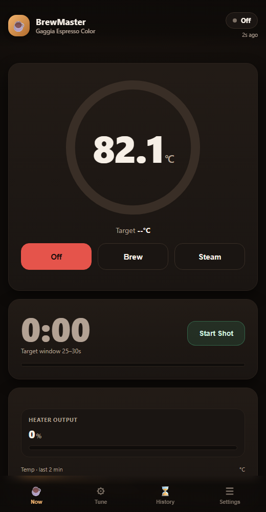

# GaggiaBrewMasterESP

A smart controller platform for a **Gaggia Espresso Color** espresso machine, built on an **ESP32-S3**. What started as a straightforward PID brew-temperature controller has grown into a full appliance-control platform: gain-scheduled Brew/Steam modes, PID autotune, eco/auto-sleep, OTA updates, WiFi reconfiguration, MQTT/Home Assistant integration — with a touchscreen HMI decided but not yet started, and a roadmap toward pump control, pressure profiling, water-level safety, and Bluetooth scale integration.

No physical machine modifications beyond what's needed to sense and switch the boiler heater — the pump, steam wand, and panel switches/indicators are left exactly as they came from the factory.

> **This README covers the essentials.** For the full technical history — every wiring decision, every reverse-engineered protocol detail, every "why," and a running change log — see [`AGENTS.md`](AGENTS.md), the project's single source of truth.

<p align="center">
  
</p>

---

## Table of contents

- [What it does](#what-it-does)
- [Hardware](#hardware)
- [How it's wired](#how-its-wired)
- [Safety](#safety)
- [Getting started](#getting-started)
- [Using it](#using-it)
- [Architecture, for developers](#architecture-for-developers)
- [Roadmap](#roadmap)
- [Project history & credits](#project-history--credits)
- [License](#license)

---

## What it does

- **Precise PID temperature control**, replacing the machine's stock bang-bang thermostat.
- **Independent Brew and Steam modes** — each with its own target temperature, its own PID gains ("gain scheduling"), and its own safety ceiling, since the two are very different thermal regimes.
- **PID Autotune** — a hand-built relay-feedback (Ziegler-Nichols) autotuner that measures your specific machine's real thermal response and computes Kp/Ki/Kd automatically, instead of guessing.
- **Eco / Auto-Sleep** — automatically powers down the heater after a configurable idle period, with a one-tap wake-up.
- **A clean local Web dashboard** — live temperature/target/output, a rolling sparkline, sensor-fault detection, mode controls, and per-profile tuning, all served directly from the ESP32 (no cloud, no app).
- **OTA firmware updates** — push new firmware over WiFi, no USB cable needed once it's installed in the machine.
- **WiFi reconfiguration on demand** — rejoin a different network without reflashing.
- **MQTT + Home Assistant auto-discovery** — optional, for anyone who wants it in a broader smart-home setup.
- **Safety-first design throughout** — mode-aware safety ceilings, sensor-fault handling with debounce, the board always boots into `OFF` (never auto-resumes heating after a reset), and a physical, independent thermal cutoff in the heater circuit (see [Safety](#safety)).

---

## Hardware

| Part | What's used | Notes |
|---|---|---|
| Machine | Gaggia Espresso Color | Aluminum boiler, vibration pump |
| Controller | ESP32-S3-DevKitC-1 (N16R8) | 16MB flash, 8MB OPI PSRAM, WiFi+BLE |
| Temperature sensor | PT100, 3-wire, PTFE cable, M4 thread | Mounted in the boiler's original thermostat port |
| Temperature module | A UART "AT-command" PT100 module | **Its silkscreen says "MAX31865" — this is misleading.** It's not an SPI MAX31865 breakout; it's a self-contained ASCII-over-UART module. This was reverse-engineered from scratch — see `AGENTS.md` for the full story. |
| Heater switch | Fotek SSR-40 DA | Solid-state relay, DC control (3-32V) → AC load (24-380V, 40A) |
| Overheat cutoff | The machine's original Steam Thermostat, reused | Re-terminated with fresh wires as an independent, physical, unconditional safety cutoff in series — not something firmware can override |
| Power | External 5V USB wall-wart | Powers the ESP32 independently of the machine's own power cord |
| Wiring | Wago 221 connectors, 18AWG silicone (mains), 22AWG (signal), Dupont | |

**Software stack:** PlatformIO + Arduino, using the `pioarduino` ESP32 platform fork. Libraries: `br3ttb/PID`, `tzapu/WiFiManager`, `knolleary/PubSubClient`.

---

## How it's wired

The key design decision: **the heater circuit doesn't depend on understanding the machine's original panel wiring at all.** That wiring (thermostats, brew/steam switches, indicator LEDs, pump) turned out to be impossible to fully verify without a multimeter, so rather than build mains wiring on guesses, only two genuinely unambiguous points in the whole machine are used — the incoming mains terminal block, and the boiler heating element's own terminals — plus the reused Steam Thermostat as a physical safety element.

```
Mains (Line) ── Steam Thermostat (reused) ── SSR terminal 1
SSR terminal 2 ── Boiler heater element ── Mains (Neutral)
SSR terminal 3 (+) ── ESP32 GPIO4        SSR terminal 4 (−) ── ESP32 GND

PT100 (3-wire) ── UART temp module ── ESP32 (GPIO18 RX / GPIO17 TX, 9600 8N1)
```

Everything else on the machine's original panel — the pump, the Brew/Steam switches, both indicator LEDs — is left completely untouched and electrically unrelated to this circuit.

Full wiring rationale, terminal-by-terminal instructions, and a before/after diagram of the heater circuit are in `AGENTS.md`, Section 7.

---

## Safety

This machine runs on **220V AC mains**. A few things worth knowing before touching any of it:

- **Bench-first, always.** Firmware gets verified over USB with the SSR/heater disconnected before any mains wiring happens.
- **The board always boots into `OFF`**, regardless of what mode was active before a reset, brownout, WiFi hiccup, or OTA update — it never silently resumes heating unattended.
- **Mode-aware safety ceilings**: Brew and Steam each have their own maximum-temperature cutoff (Steam's is configurable from the Web UI, clamped to a safe range so a typo can't set a dangerous limit).
- **The reused Steam Thermostat is a genuine hardware backstop** — it sits in series ahead of the SSR, so it can cut heater power regardless of what the firmware is doing, even if the ESP32 crashes or hangs.
- **Sensor-fault handling** debounces transient faults but latches a hard `-999` error (heater forced off) if the sensor stays unreadable.
- One known, accepted trade-off: **no external pull-down resistor on the SSR's GPIO trigger line** — the user explicitly chose to accept the small, recurring (any-reset) risk of a few-millisecond boot glitch rather than source a resistor. Documented in `AGENTS.md` §7 for anyone revisiting this decision.

If you're adapting this project for your own machine, **read `AGENTS.md` §6 and §7 in full** before wiring anything to mains.

---

## Getting started

### 1. Build & flash

Requires [PlatformIO](https://platformio.org/) (CLI or the VS Code extension).

```bash
git clone <this-repo-url>
cd GaggiaBrewMasterESP

# First build downloads the ESP32-S3 toolchain - several minutes
pio run -e esp32-s3-devkitc-1

# Flash over USB
pio run -e esp32-s3-devkitc-1 -t upload
```

The board enumerates as a native-USB serial device. If upload fails, hold **BOOT**, tap **RESET**, then release **BOOT** to force download mode.

### 2. First-time WiFi setup

1. Power the board (USB is enough for this step — no mains wiring needed yet).
2. Connect your phone/laptop to the WiFi network **`GaggiaBrewMasterESP_Setup`**.
3. A captive portal should open automatically (or visit `192.168.4.1`). Enter your home WiFi credentials.
4. The board reboots and joins your network. Find it at **`http://gaggia.local`**, or check your router for its IP.

### 3. Verify on the bench before going anywhere near mains

With the board on USB power only (SSR/heater fully disconnected), confirm the Web UI loads and shows a live, sane temperature reading from the PT100. **Only after that** should the heater circuit ever get wired up — see `AGENTS.md` §7 for the full procedure.

---

## Using it

Open `http://gaggia.local` (or the board's IP) in any browser.

- **Mode buttons** — Off / Brew / Steam. Autotune runs against whichever mode is currently selected.
- **PID tuning** — independent Kp/Ki/Kd (and target temperature) for Brew and Steam, saved instantly.
- **Start Auto-Tune** — cycles the heater in a controlled relay-feedback pattern to measure your machine's real thermal response and compute new gains automatically. Takes several minutes; stay nearby the first time. Can be stopped at any point, either with its own button or by switching modes.
- **Power & Eco card** — set the auto-sleep timeout (0 disables it); a banner + "Wake Up" button appears whenever it's asleep.
- **Network card** — reset WiFi credentials (reboots into the setup network above) and a link to the OTA firmware-upload page.
- **MQTT / Home Assistant** — optional broker configuration for anyone integrating this into a broader smart-home setup.

---

## Architecture, for developers

- `src/main.cpp` — the PID loop, the `OpMode` (Off/Brew/Steam) state machine, eco-sleep, and the autotune state machine.
- `src/temp_sensor.cpp` / `include/temp_sensor.h` — the UART driver for the temperature module (protocol: send `AT+T\r\n`, get back `+T=<value>\r\nOK\r\n`).
- `src/web.cpp` / `include/web.h` — the WebServer, the entire self-contained dashboard (no external assets, no CDN), WiFiManager captive portal, and OTA handlers.
- `src/mqtt.cpp` / `include/mqtt.h` — MQTT + Home Assistant auto-discovery.
- `include/config.h` — pins, per-profile defaults, safety ceilings, eco-sleep and autotune parameters.
- `src/sniffer.cpp` — a standalone UART protocol-prober (its own PlatformIO env), kept around as reusable tooling for reverse-engineering any future unknown-protocol hardware.

**`AGENTS.md` is the authoritative technical document** — every architectural decision, every piece of reverse-engineering (the temperature module's protocol took real detective work to crack), every hardware trade-off, and a dated change log of the entire build process, are recorded there in detail.

---

## Roadmap

Informed by researching two mature sibling projects — [Gaggiuino](https://github.com/Zer0-bit/gaggiuino) and [GaggiMate](https://github.com/jniebuhr/gaggimate) — and the actual coffee science behind espresso/cappuccino extraction (SCA guidelines, pressure-profiling literature). Full reasoning for every item is in `AGENTS.md` §8; concrete buy lists and wiring diagrams are in [`HARDWARE_ROADMAP.md`](HARDWARE_ROADMAP.md). Ordered by priority below, not by cost — items 1-3 are already shipped (pure software), everything after is not yet built:

**Shipped:**
- Shot timer (espresso extraction has a real target window, ~25-30s)
- Shot history log (duration + peak temp per shot)
- Descale / maintenance reminder

**Next up — the core goal, auto-stopping the pump:**
- **On/off pump control ("control the button")** — the Brew switch keeps starting the pump exactly as today; the ESP32 sits between the switch and the pump (a plain relay, not an SSR — the pump only switches once per shot, so an SSR's silent/no-wear advantages don't apply, and a relay is cheaper; no phase-angle timing either way) so firmware can cut it early, at a configured time or weight
- **Bluetooth smart scale** (Bookoo or Felicita — confirmed the DIY-friendliest protocols) for brew-by-weight auto-stop, pairing directly with the pump control above; brew-by-weight is more repeatable than brew-by-time

**Then, independent and optional, in priority order:**
- Water tank level sensor (~$2-5 magnetic float switch) — low-water warning now, a real pump interlock once pump control above exists; the tank is removable, so this needs spring-contact wiring, not a bare soldered wire
- Real-time pressure transducer + live pressure graph (0-1.2 to 1.6MPa, mounted at the pump outlet — same spec both competitor projects use)
- Phase-control dimmer to a pressure target (e.g. 9 bar) — pre-infusion and declining-pressure curves, not a flat target, built with the same bench-first safety discipline as the heater circuit; genuine closed-loop control, so it needs the pressure transducer above already wired first. (Migrating to GaggiMate instead was considered and ruled out — it requires their own controller PCB and a different temp sensor, i.e. a hardware swap, not a firmware migration onto this board; see `AGENTS.md` §8.)
- Nextion touchscreen HMI for on-machine status and control without needing a phone — **decided, not yet started** (not "in progress" — no hardware bought, no driver written)
- Milk temperature probe for cappuccino/steaming (~$2-3 DS18B20 probe) — a real gap neither Gaggiuino nor GaggiMate address, and the cheapest item here, but ranked last: it only works dipped into a separate pitcher, so a wire has to leave the machine every use

---

## Project history & credits

This project began as a clone of [`petoz/gaggia_pid_esp32-c6`](https://github.com/petoz/gaggia_pid_esp32-c6), originally targeting the ESP32-C6 with a genuine SPI MAX31865 sensor. It was retargeted to the ESP32-S3, and along the way the actual temperature sensor hardware turned out to be an entirely different, undocumented UART module — reverse-engineered from scratch on the bench. From there the project grew substantially beyond the original: Brew/Steam gain scheduling, PID autotune, eco-sleep, OTA, WiFi management, and a full mains-wiring redesign around the machine's actual (partially unknowable) panel circuitry.

Credit to the original project for the starting skeleton. The full history of every decision since is in `AGENTS.md`.

## License

[MIT](LICENSE).
