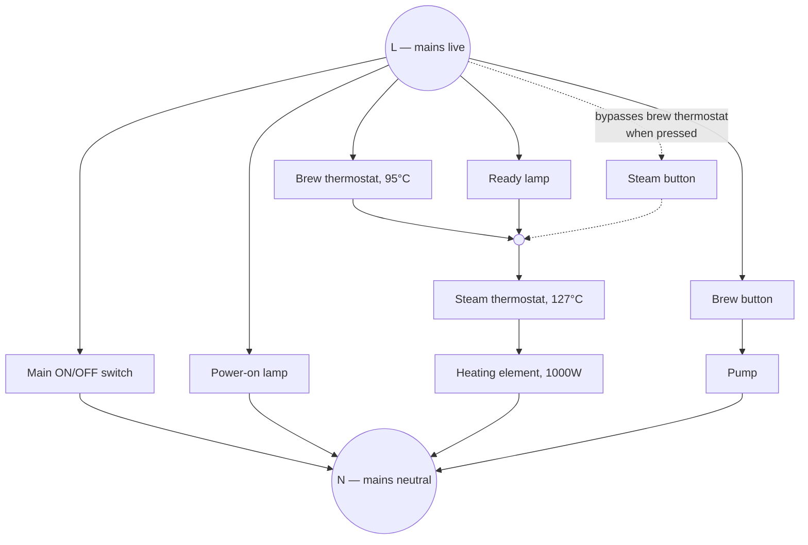
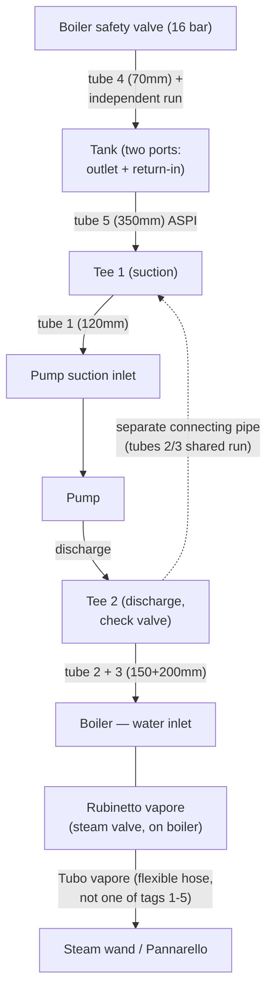

# OEM manuals — Gaggia New Espresso 06 / Pure & Color

Original manufacturer documents for this project's target machine (Gaggia
Espresso Color; per [`AGENTS.md`](../../AGENTS.md) Section 1, "New Espresso 06 /
Pure & Color" is the same model family). Added 2026-08-30 — see the
[`AGENTS.md`](../../AGENTS.md) Section 10 change log entry for that date for
what these resolved.

**Read `AGENTS.md` first, not this file** — it's the project's authoritative
doc. This directory is source material; the facts extracted from it are
already folded into `AGENTS.md` Sections 2/4/7 and `HARDWARE_ROADMAP.md`.
Come here only when you need the original diagram/page itself.

| File | Drawing/doc # | What it is |
|------|----------------|------------|
| [`electrical-schematic-SAE0486.pdf`](electrical-schematic-SAE0486.pdf) | SAE0486 (25/11/06) | Official schematic + topographic wiring diagram, 120V/230V. Shows the on/off switch, brew switch/thermostat, steam switch/thermostat, ready/power lamps, and pump on one page. |
| [`hydraulic-schematic-SAI0103.pdf`](hydraulic-schematic-SAI0103.pdf) | SAI0103 (14/02/2007) | Official water-circuit diagram: tank → pump → 3-way fitting → boiler, safety-valve discharge line, steam tap/wand line, with the exact silicone tubing part numbers/sizes for each run. |
| [`parts-catalog-ER0270.pdf`](parts-catalog-ER0270.pdf) | ER0270 Rev.00 (03-08-07) | Official exploded-view parts catalog (bodywork + boiler assemblies) with part numbers, including thermostat/heater/pump model numbers and ratings. |
| [`user-manual.pdf`](user-manual.pdf) | — (2007, multi-language) | Official end-user instruction manual. |

## Key facts extracted (already in AGENTS.md, repeated here for quick lookup)

From the parts catalog (TAV. 2 — CALDAIA):
- **Brew thermostat ("Termostato Caffè"):** 95°C, Gaggia P/N `12000160`, model `US-622AXTDNO`.
- **Steam thermostat ("Termostato Vapore"):** 127°C, Gaggia P/N `12000161`, same `US-622AXTDNO` family.
- **Heating element:** stainless boiler, 1000W — `230V` (P/N `11001002`) or `120V` (P/N `11004509`) variant.
- **Pump:** ULKA `EP5/S` (230V-50Hz, P/N `12000140`) or `EAP5/S` (120V-60Hz, P/N `12000142`).

From the hydraulic schematic (SAI0103):
- **Safety valve discharge rating: 16 bar** ("SCARICO VALVOLA DI SICUREZZA 16 bar").

## Electrical circuit — transcription (SAE0486)

> **Read this before touching anything mains-voltage.** This is an AI's
> visual reading of a hand/CAD-drawn schematic, cross-checked against the
> parts catalog and basic component physics (see **Validation notes**
> below) and transcribed into text so an agent without PDF access can still
> work from it — it is **not a substitute for the original drawing**.
> Confidence varies by branch (marked below). This project's actual mains
> build (`AGENTS.md` Section 7) is a from-scratch clean-bypass circuit that
> does **not** depend on any of this legacy panel topology being correct —
> nothing here should be used to justify reviving the old panel wiring
> without first re-verifying against the PDF
> (`electrical-schematic-SAE0486.pdf`) or the physical machine.

**Legend** (numbering is the schematic's own — the *user manual*'s separate
FIG.01 numbers the same kind of parts differently, don't cross-reference the
two by number):

| # | Component | Original Italian label |
|---|-----------|-------------------------|
| 1 | Pump | Pompa |
| 2 | Mains power-cord inlet socket (3-pole) | Spina autobloccante |
| 3 | Main ON/OFF switch | Interruttore ON/OFF |
| 4 | Brew thermostat, 95°C | Termostato caffè |
| 5 | Heating element | Resistenza |
| 6 | Steam thermostat, 127°C | Termostato vapore |
| 7 | Steam button | Interruttore vapore |
| 8 | "Ready" lamp | Spia pronto macchina |
| 9 | Power-on lamp | ON/OFF spia |
| 10 | Brew button | Interruttore caffè |

**Circuit** (L and N are the incoming mains rails, sourced through inlet
socket 2 — confirmed at high zoom: it's a physical 3-pin connector labeled
**L / Earth / N**, fed directly by the incoming power cord):

**Walkthrough:**
1. **Main switch and power lamp are two independent branches, not one
   series pair (medium confidence — flagged as odd, see Validation
   notes):** zoomed in expecting to find the switch and lamp in series
   (the obvious design), but the drawing clearly shows two separate wires
   off L, each running straight to N with nothing else in the branch —
   switch alone, lamp alone. Wired as literally drawn, the switch branch
   has no load in series with it, which is electrically strange for a
   "master switch." Possible explanations: it's a reference/test switch
   not meant to be read as a master power switch (the legend's OCR gave a
   garbled "INTERRUTTORE RFIT ON/OFF" — possibly "RIF." /reference/, which
   would fit), or there's a mechanical/multi-pole detail this single-line
   schematic doesn't capture. Left unresolved rather than guessed at.
2. **Heating branch (high confidence, refined from the previous pass):**
   the brew thermostat *and* the ready lamp **both tap L independently**
   and rejoin at the same junction, which then continues through the steam
   thermostat and heating element to N — the lamp runs in parallel with
   the thermostat itself (not "after" it, as the previous version of this
   section had it). Electrically this means: while the brew thermostat is
   closed (actively heating, below 95°C) the junction sits at L on both
   sides of the lamp, so it stays **dark**; once the thermostat opens
   (95°C reached) the junction can only be reached through the lamp's
   high-resistance path, so nearly all the voltage drops across the lamp
   and it **lights** — i.e. "lit = ready," the more intuitive reading,
   corrected from the previous version's "lit while heating" guess. The
   steam button taps L directly into the same junction too — now clearly
   visible as its own dot in the high-resolution render — confirming the
   bypass topology at high confidence (upgraded from the previous pass's
   "verify against the PDF" hedge): pressing it holds the junction at L
   regardless of the brew thermostat, letting heating continue toward the
   steam thermostat's 127°C cutoff.
3. **Pump branch (high confidence, unchanged):** brew button → pump → N.
   Matches both the topographic half of this same drawing (a "blue" wire
   run to the pump) and the user manual's own description of its brew/
   hot-water button driving the pump.

### Topographic wiring — physical harness colors

> The functional circuit above is settled; this section instead transcribes
> the **other half of the same drawing** — the physical wire-color layout
> (bottom half of `electrical-schematic-SAE0486.pdf`) — translated to
> English. Added 2026-08-30 after the user supplied a copy of this exact
> diagram and asked for it to be transcribed to match. Rendered at 8x
> (~575 DPI) with PyMuPDF and cropped into each connector/terminal
> individually, same method as the schematic re-checks above.

**Color legend:**

| Italian | English |
|---------|---------|
| bianco | White |
| blu | Blue |
| marrone | Brown |
| grigio | Grey |
| nero | Black |
| rosso | Red |
| arancio | Orange |

**Traced connections (high confidence — each is a direct wire run traced
between two labeled terminals at high zoom):**

| Wire color | From | To |
|---|---|---|
| White | Pump (1) | Brew button (10) — the switched leg |
| Blue | Pump (1) | Same Blue rail as the heating element's (5) terminal, and the mains inlet (2)/main switch (3) wiring below — i.e. the unswitched leg |
| Blue | Mains inlet (2), **L** pin | Main switch (3), pin **3** |
| Blue | Mains inlet (2), **N** pin | Main switch (3), pin **2** |
| Brown | Main switch (3), pin **1** | Brew thermostat (4) |
| Grey | Main switch (3), pin **4** | Steam thermostat (6) |
| Red | Steam thermostat (6) | Steam button (7) |

**Walkthrough:**
1. **Pump wiring matches the field-confirmed fact already in `AGENTS.md`
   §7 and `HARDWARE_ROADMAP.md` item 4** (White = switched, to the brew
   button; Blue = unswitched): this transcription is the origin of that
   fact, now traced directly from the diagram rather than relayed from a
   photo.
2. **Main switch (3) is physically a 4-terminal part, not the simple
   2-terminal switch the single-line schematic implies.** It's drawn as a
   round connector/switch body with pins 1/2/3/4 in a 2×2 pattern: pins 2
   and 3 wire straight to the mains inlet's N and L, pins 1 and 4 wire
   onward to the brew and steam thermostats. **This is a plausible
   explanation for the open question flagged in the schematic walkthrough
   above** (switch 3 drawn as a branch with "no load in series," odd for a
   master switch) — a 4-terminal part fits the parts catalog's separate
   **"On-off bipolar switch"** (`parts-catalog-ER0270.pdf` TAV.2 pos. 46,
   P/N `5332004000`, physically listed right next to the mains inlet
   pos.47 and pump pos.49/50 — the same cluster this topographic diagram
   draws), rather than the catalog's other, unrelated **"Unipolar
   switch"** (TAV.1 pos.20). If it's a true bipolar switch, it breaks
   *both* rails downstream, which would make the single-line schematic's
   simplification (one switch symbol, no load drawn) more sensible than
   it first appeared. **Not confirmed** — the diagram is a black box as
   far as which internal pole pairs with which; a human checking the
   physical switch is what would actually settle this.
3. **Steam side confirmed independently:** switch(3) pin 4 → Grey →
   steam thermostat (6) → Red → steam button (7) is a clean, unambiguous
   run at high zoom, consistent with the schematic's steam-button-bypass
   finding.
4. **Not fully re-traced (lower confidence, not load-bearing for anything
   in this project):** the Black/Brown run along the bottom edge feeding
   the brew button (10) and steam button (7), and the Orange wire off the
   ready lamp (8) — both visually route toward the same components the
   schematic already places correctly (the L-rail fan-out to both buttons,
   and the ready lamp's tap into the thermostat junction), so nothing here
   contradicts the validated schematic, but the exact terminal-level
   pairing for 7/8/9/10 wasn't pinned down with the same certainty as the
   rest of this table. Flagging rather than guessing, per this document's
   own rule for mains-voltage material.

### Validation notes

**2026-08-30, second pass (high-resolution re-check):** rendered the PDF at
6x (~430 DPI) with PyMuPDF and cropped into each junction individually,
the same technique that caught the hydraulic-diagram errors. This refined
(rather than overturned) the electrical reading:
- **Ready lamp actually taps L directly, in parallel with the brew
  thermostat itself** — not "downstream of it" as the first pass had it.
  Both feed the same junction, which then continues through the steam
  thermostat and heater to N. Re-derived the lamp's behavior from this
  corrected topology: **lit = ready** (thermostat open), dark while
  actively heating — the opposite of the first pass's guess, and the more
  intuitive reading besides.
- **The steam button's bypass wiring — previously flagged as unverifiable
  — is now confirmed at high confidence.** The high-resolution render
  shows the steam button's wire clearly joining the same junction as the
  brew thermostat and ready lamp, settling what the first pass could only
  guess at functionally.
- **Confirmed component 2 with certainty**, closing out the first
  correction: it's a physical 3-pin connector labeled **L / Earth / N** in
  the topographic diagram, wired directly to the incoming power-cord
  drawing right next to it. No remaining doubt this is the mains inlet
  socket, not a pump-specific part.
- **New open question found, not resolved:** the main ON/OFF switch and
  the power-on lamp are drawn as **two independent branches**, each wired
  straight across L→N with nothing else in series — not the series pair
  the first pass assumed. Read literally, the switch branch has no load,
  which is electrically odd for a "master switch." Documented as
  unresolved in the walkthrough above rather than guessed at — this is
  exactly the kind of thing worth a human checking against the physical
  switch/lamp assembly rather than trusting either AI reading.

**2026-08-30, first pass:** two corrections found on the initial re-check,
done because this is mains-voltage reference material:
- **Inlet socket, not a pump connector.** Originally placed component 2 in
  series with the pump's supply wire, based only on its position near the
  bottom of the drawing. Cross-checking the parts catalog
  (`parts-catalog-ER0270.pdf`, TAV.2 item 47: "SPINA AUTOBLOC.TRIPOL." —
  "self-locking **three-pole** plug") showed it's actually the machine's
  mains power-cord inlet (3 poles = live/neutral/earth; a pump lead would
  only need 2) — now directly confirmed by the second pass above.
  Corrected — it no longer appears in the pump branch.
- **Ready lamp is a parallel tap, not a series element.** Originally drawn
  in series between the two thermostats and the heating element — not
  possible, a neon pilot lamp's series resistor limits current to a couple
  of mA, nowhere near a 1000W element's load. Corrected to a parallel tap
  (position refined further by the second pass above).

## Hydraulic circuit — transcription (SAI0103)

> **This section was rewritten 2026-08-30 after the user flagged the first
> version as wrong** ("from the tank it's 2 water outputs"). That flag was
> correct — the first pass missed a real tank outlet and mis-traced several
> connections. This version was rebuilt by rendering the PDF at high
> resolution (6x, ~430 DPI) and cropping into each junction individually
> rather than reading the page at normal size — see **Validation notes**
> below for exactly what changed and what's still not 100% certain.

**Tubing legend** (every tube in the diagram, with its real size — this is
what was missing before):

| Tag | Part No. | Bore × OD | Length | Material | Qty |
|-----|----------|-----------|--------|----------|-----|
| 1 | AG3170 | 5×9mm | 120mm | Silicone | 2 (both instances shown below) |
| 2 | 11001207 | 4.2×8.2mm | 150mm | Reinforced silicone, pink | 1 |
| 3 | 11001206 | 4.2×8.2mm | 200mm | Reinforced silicone, pink | 1 |
| 4 | DM1206/015 | 5×9mm | 70mm | Silicone | 1 |
| 5 | PA1062 | 5×9mm | 350mm | Silicone ("ASPI" — see note) | 1 |

**Circuit (corrected 2026-08-30, fifth pass — confirmed directly by the
user tracing the actual page live, port by port. This is the highest-
confidence version; see Validation notes for what changed from the fourth
pass):**

**Walkthrough:**
1. **Two separate connecting pipes, not one, and not zero** — this took
   three attempts to get right (see Validation notes): the third pass had
   both the Tee2-Tee1 link *and* the safety valve sharing one junction; the
   fourth pass over-corrected and dropped the Tee2-Tee1 link entirely,
   attaching the safety valve straight to the tank instead. The user's
   final direct trace confirmed **both connections exist independently**:
   - **Tee 2 &harr; Tee 1**: a separate pipe links the two tees directly to
     each other (sharing tubes 2/3's run), alongside their main jobs (Tee 1
     merging the tank's supply into the pump's suction; Tee 2 splitting the
     pump's discharge toward the boiler).
   - **Boiler safety valve &rarr; Tank**: a second, fully independent line,
     touching neither tee, running from the valve straight to a **second
     port on the tank** (tag 4's 70mm stub is the short local connector at
     the valve end of this run).
2. **This settles where item 7's pressure-transducer T-fitting goes**: the
   **Tee 2 &rarr; boiler segment specifically** is the only branch that
   carries the pump's actual delivered pressure without also reflecting
   the Tee2-Tee1 connecting pipe or the safety-return line.
3. **The steam side remains a separate, distinct sub-circuit**, not fed by
   the tank/pump/return path at all and not made of any of tags 1-5: the
   boiler's own steam valve ("Rubinetto vapore") feeds the steam wand/
   Pannarello through its own flexible hose ("Tubo vapore"), a wand-
   assembly component, not one of the five silicone tubes in this table.

### Validation notes (2026-08-30 rewrite)

The **first version of this section was substantially wrong** — logged
here rather than silently replaced, since the corrections change the whole
shape of the diagram, not just one detail:
- **Missed that the tank has two outlets entirely.** The first pass only
  traced one path out of the tank (to the pump) and treated a second,
  separate line as if it were a continuation of the same run toward the
  boiler. Re-cropping the tank's bottom edge at high zoom showed two
  distinct stub fittings, not one.
- **Never identified the pump's discharge path at all** — the first
  version went straight from "pump" to "3-way tee" as if the tee sat on
  the pump's output side. It's actually on the **suction** side (merging
  tank outlet B with the safety valve's discharge back into the pump's
  inlet); the pump's actual discharge runs a completely different path up
  toward the boiler, which the first version never traced.
- **Mislabeled the 3-way tee as sitting between the pump and the boiler.**
  It doesn't — per the above, it's a suction-side junction, not a
  discharge-side one.
- **Never previously listed tube sizes at all** — the "Tubing legend"
  table above (added at the user's request) didn't exist in the first
  version.
- **Still a reasoned inference, not a certainty:** tube 5's exact function
  (air-intake for the Pannarello). It's well-supported by the "ASPI" label
  and the Pannarello destination, but this drawing alone doesn't spell out
  "aria" (air) anywhere, so treat it as the best available reading, not a
  confirmed fact.

**2026-08-30, second correction — verified directly against the actual page
image, not a description of it:** the guess above (tube 5 = Pannarello
air-intake) was wrong. Tube 5 (350mm, "ASPI") is drawn on the tank-to-pump
side of the circuit, not anywhere near the steam wand — it's the tank's
suction run to the suction-side tee, exactly what "aspirazione" (suction)
would suggest once its actual position is visible. The steam wand is fed
by its own flexible hose off the "Rubinetto vapore," not by any of tags
1-5.

**2026-08-30, third correction — the second pass still had the discharge
side wrong.** It assumed tubes 2+3 ran directly from the pump's outlet to
the boiler with nothing in between. Confirmed directly by the user tracing
the live page port-by-port: there are **two tees, not one**. A second tee
sits right at the pump's discharge (with a check valve), splitting toward
the boiler *and* tying into the same 16-bar safety-valve return line that
also joins the suction-side tee — so tags 2/3 are mostly the **return
line**, not a clean pump-to-boiler run, and the actual pump-to-boiler feed
is the short segment between this new discharge tee and the boiler itself.
This matters concretely for item 7: the pressure-transducer T-fitting has
to go on that specific boiler-bound segment *after* the check-valve
junction, not at the junction itself or anywhere on the return line — both
of which would read the relief path's behavior instead of the pump's
actual delivered pressure.

**2026-08-30, fourth correction — the third pass's shared junction was
wrong.** It had the safety-valve return line tying into the pump's
discharge tee (Tee 2) via a check valve before continuing on to the
suction tee (Tee 1). Corrected by the user's direct trace: **the
safety-valve line is fully independent** — it runs straight from the
boiler's safety valve to a second port on the tank, touching neither tee.

**2026-08-30, fifth correction — the fourth pass over-corrected.** In
fixing the shared-junction error, it dropped the Tee2-Tee1 connecting pipe
entirely, as if the two tees no longer had anything linking them.
Confirmed wrong by the user's final direct trace: **both connections
exist, independently** — Tee 2 and Tee 1 are linked by their own separate
pipe (sharing tubes 2/3's run), *and* the safety valve's line to the tank
is a completely separate, third physical run. Three corrections in from
the same "two tees" discovery, but this is the version confirmed
port-by-port with nothing left unaccounted for. None of this changes item
7's answer — the transducer still goes on the Tee 2 → boiler segment
specifically, since that's the one branch none of these connecting pipes
touch.

## Parts catalog — full listing (ER0270)

Transcribed directly from the catalog's own English column (it's bilingual
in the source; Italian dropped here since the source already gives English
descriptions). Positions match the numbered exploded-view diagrams in
`parts-catalog-ER0270.pdf` — open that PDF if you need to see where a
position number actually points on the physical part.

### TAV. 1 — Bodywork assembly

| Pos | Part No. | Description |
|-----|----------|--------------|
| 01 | 4337026000 | Upper inside package |
| 02 | 4337027000 | Upper external package |
| 03 | 4337028000 | Package box |
| 04 | 4337031000 | Instructions booklet |
| 05 | WGA2PR/1 | Separator |
| 06 | NF08/002 | 1-cup filter, 5.5/6.5g |
| 07 | NF08/005 | 2-cup filter, 12/14g |
| 08 | 11005535 | Filter for pod |
| 09 | 11007038 | "Perfect crema" filter, Ø0.6mm |
| 10 | WGADM1017 | Measuring scoop |
| 11 | 4337004000 | Drip grid |
| 12 | 4337007000 / 11006932 | Drip tray — black (Pure) / red metallic (Color) |
| 13 | WGAFG0245 | Foot |
| 14 | 11005482 | Cap for bottom of bodywork |
| 15 | 11006683 / 11006933 | Body — black (Pure) / red metallic (Color) |
| 16 | CF0292/SCH (+GB/CH/AUS/USA variants), 11005633 | Power cord (country-specific plug variants) |
| 17 | 12000782 | Green pilot lamp, 120V-230V |
| 18 | 4337018000 | Switch button (black) |
| 19 | 4337019000 | Keys/buttons support |
| 20 | 5337002000 | Unipolar switch |
| 21 | 8337008000 | Keyboard cover assembly, black |
| 22 | 8337005000 | Steam knob assembly |
| 23 | 4337014000 / 11006935 | Machine cover — black (Pure) / black assembly (Color) |
| 24 | 11005142 | Tank assembly |
| 25 | 4337012000 | Tank handle |
| 26 | 144650800 | Water tank filter |
| 27 | 140328461 | O-ring, metric 0190-10, EPDM |
| 28 | 140324362 | O-ring, metric 0060-30, silicone |
| 29 | 126764718 | Spring for water-container valve |
| 30 | 147660562 | Water-valve container piston, grey |
| 31 | 11007400 | Water-valve container piston, black |
| 32 | 4337010000 | Tank cover |
| 33 | DM0814 | Spring for timer knob |
| 34 | 11006030 | Filter basket (plastic) |
| 35 | 18G1514 | Filter-retaining spring |
| 36 | 6301002000 | Filter holder cup |
| 37 | 4332037000 | Filter holder knob |
| 38 | WGADM1319 | Special screw, 6x16 |
| 39 | 4332038000 | Filter-holder knob cap |
| 40 | 4301006000 | 2-way spout |
| 41 | 4337024000 / 11008908 | Wiring harness assembly (standard / UL variant) |
| 42 | DI7981P4.2X16Z | Self-tapping galvanized screw, plastic |

### TAV. 2 — Boiler assembly

| Pos | Part No. | Description |
|-----|----------|--------------|
| 01 | 11001002 / 11004509 | Heating element, stainless boiler, 1000W — 230V / 120V |
| 02 | U023.022 | Screw TCEI M6.0x30 |
| 03 | 11001465 | Brass nut for stainless boiler |
| 04 | 149361400 | Transparent silicone tube 5x9, 65SH (roll) |
| 05 | DI7981P3.5X9.5Z | Self-tapping galvanized screw, plastic |
| 06 | 12000361 | Oetiker clamp, D=9 |
| 07 | 140323062 | O-ring 2043, silicone |
| 08 | 11001000 | Brass nozzle, stainless boiler |
| 09 | 12000160 | **Thermostat, 95°C, model US-622AXTDNO — brew** |
| 10 | 11000998 | Brass faucet connector, stainless boiler |
| 11 | 16000380 | Silicone tube 5x8.9 (roll) |
| 12 | 11001462 | Stainless upper boiler casing |
| 13 | 12000161 | **Thermostat, 127°C, model US-622AXTDNO — steam** |
| 14 | 140320662 | O-ring 106, silicone |
| 15 | 11000994 | Thermostat-retaining spring |
| 16 | 128310304 | Washer, burnished |
| 17 | 129821402 | Screw TCB M3x4 |
| 18 | 12000087 | O-ring, metric 0850-30, silicone |
| 19 | 123390109 | Brass nut, 1/8 gas |
| 20 | 11004588 | Stainless lower boiler casing/base assembly |
| 21 | EF0012 | Seal for valve |
| 22 | EF0013 | Spring for boiler valve |
| 23 | 11000996 | Brass valve-holder screw |
| 24 | 11005079 / 11009073 | Filter-holder retaining ring — 230V / 120V |
| 25 | 0701.031.150 | Seal cover, grey |
| 26 | 129535721 | Screw TSP 3.5x9.5, stainless |
| 27 | 145842900 | Water-container valve seal (Gaco, dim.14) |
| 28 | 0701.014.150 | Seal container, grey |
| 29 | 140320461 | O-ring, metric 0080-20, Termoil |
| 30 | 11007402 | Seal cover, black |
| 31 | 11007403 | Water-container valve seal, silicone (Gaco, dim.14) |
| 32 | 11007401 | Seal container, black |
| 33 | DI7981P4.2X16Z | Self-tapping galvanized screw, plastic |
| 34 | 4337008000 | Components plate |
| 35 | UN5931-5X12I | Screw 5x12, stainless |
| 36 | 11001471 | Percolator/shower disc, Ø49.5 |
| 37 | DI7987-5X8I | Screw TSP M5x8, stainless |
| 38 | 11004543 | Filter-holder seal |
| 39 | 4337005000 | Power-inlet support bracket |
| 40 | 4332055000 | Support for spherical union |
| 41 | 4332049000 | Spherical union (Grivory) |
| 42 | DM0041/088 | O-ring gasket 2025, EPDM |
| 43 | 4332050000 | Coupling for spherical union |
| 44 | AM0011/01 | Steam tube, lower, chromed |
| 45 | 8301006000 | Frother/Pannarello assembly |
| 46 | 5332004000 | On-off bipolar switch |
| 47 | DM1563/GW / NE13.013 | **Mains power-cord inlet — self-locking 3-pole plug (230V) / IEC C13 cup socket (120V)** |
| 48 | 4337009000 / 11006934 | Power-input mask — black (Pure) / red metallic (Color) |
| 49 | WGADY0003 | Pump support, Ulka |
| 50 | 12000140 / 12000142 | **Pump, Ulka EP5/S GW (230V-50Hz) / EAP5/S (120V-60Hz)** |
| 51 | 147920300 | Tee connector, D=8 |
| 52 | 11001007 | Boiler valve assembly, black |
| 53 | DM1596 | Pump suction inlet fitting |
| 54 | 9011.144 | Fork for D.4 tube |
| 55 | 11007270 | Faucet/cock body (self-priming valve) |
| 56 | 11001003 | Faucet shaft, brass |
| 57 | WGAEF0061 | Sphere, Viton 85SH, D=5 |
| 58 | EF0099 | Self-priming valve discharge fitting |
| 59 | EF0111 | Gasket, Teflon |
| 60 | WGADM0041/031 | O-ring 2018, Viton 70SH |
| 61 | PA1062 | Pump suction pipe |

## What this does and doesn't settle

- **Settles** the previously-"unknown" steam-thermostat trip point
  (AGENTS.md Section 4) at 127°C, and the brew thermostat at 95°C — see the
  Section 4/7 updates for what that means for `STEAM_MAX_SAFETY`.
- **Does NOT retroactively confirm** the specific *this-unit's* panel wiring
  described secondhand in AGENTS.md Section 7's "historical investigation"
  subsection (LED colors, which wire goes to the pump vs. mains, etc.) — this
  is the factory reference schematic for the model line, not a photo of the
  actual unit's current wiring, which may have been serviced/modified. The
  project's mains-wiring plan deliberately doesn't depend on that panel
  wiring anyway (clean-bypass design), so this is informational, not a
  reason to revisit that decision on its own.
  - **Update (2026-08-30):** the pump/Brew-switch half of this gap is now
    closed — the user separately hand-traced the actual unit's topographic
    wiring while wiring item 4 (pump relay) and confirmed White = the
    switched wire (to the Brew Switch, component 10), Blue = unswitched
    (straight to the Main Switch, component 3). See `AGENTS.md` §7's
    "Update" note and `HARDWARE_ROADMAP.md` item 4 for how that's used.
