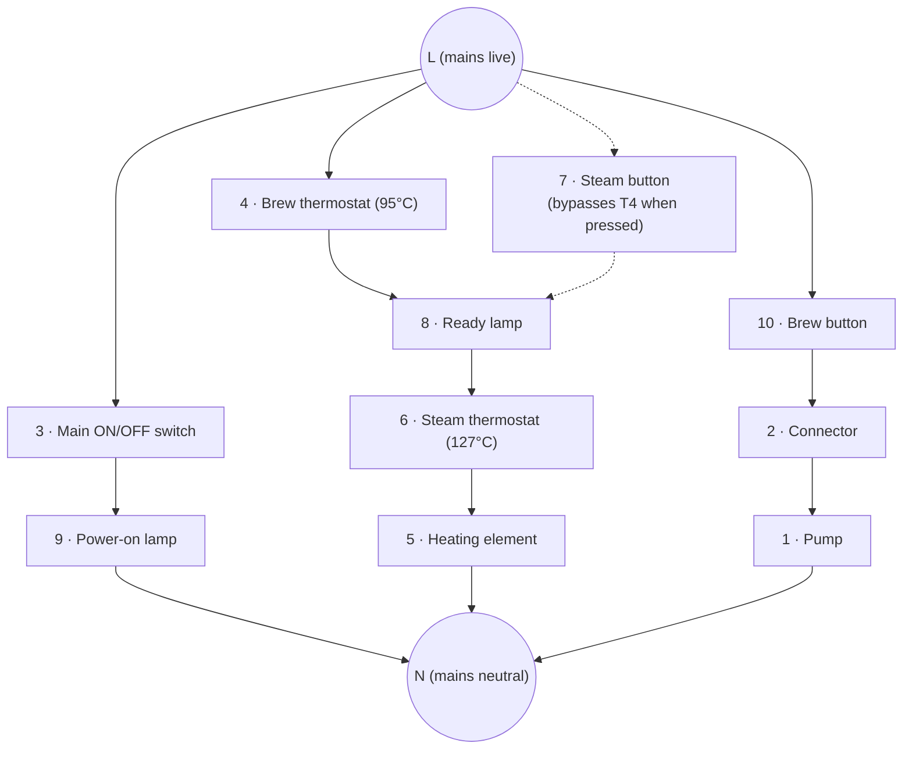
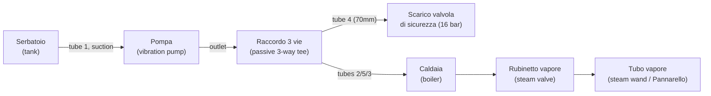

# OEM manuals — Gaggia New Espresso 06 / Pure & Color

Original manufacturer documents for this project's target machine (Gaggia
Espresso Color; per [`AGENTS.md`](../../AGENTS.md) Section 1, "New Espresso 06 /
Pure & Color" is the same model family). Added 2026-08-30 — see the
[`AGENTS.md`](../../AGENTS.md) Section 10 change log entry for that date for
what these resolved.

**Read `AGENTS.md` first, not this file** — it's the project's authoritative
doc. This directory is source material; the facts extracted from it are
already folded into `AGENTS.md` Sections 2/4/7 and `HARDWARE_ROADMAP.md`.
Come here only when you need the original diagram/page itself.

| File | Drawing/doc # | What it is |
|------|----------------|------------|
| [`electrical-schematic-SAE0486.pdf`](electrical-schematic-SAE0486.pdf) | SAE0486 (25/11/06) | Official schematic + topographic wiring diagram, 120V/230V. Shows the on/off switch, brew switch/thermostat, steam switch/thermostat, ready/power lamps, and pump on one page. |
| [`hydraulic-schematic-SAI0103.pdf`](hydraulic-schematic-SAI0103.pdf) | SAI0103 (14/02/2007) | Official water-circuit diagram: tank → pump → 3-way fitting → boiler, safety-valve discharge line, steam tap/wand line, with the exact silicone tubing part numbers/sizes for each run. |
| [`parts-catalog-ER0270.pdf`](parts-catalog-ER0270.pdf) | ER0270 Rev.00 (03-08-07) | Official exploded-view parts catalog (bodywork + boiler assemblies) with part numbers, including thermostat/heater/pump model numbers and ratings. |
| [`user-manual.pdf`](user-manual.pdf) | — (2007, multi-language) | Official end-user instruction manual. |

## Key facts extracted (already in AGENTS.md, repeated here for quick lookup)

From the parts catalog (TAV. 2 — CALDAIA):
- **Brew thermostat ("Termostato Caffè"):** 95°C, Gaggia P/N `12000160`, model `US-622AXTDNO`.
- **Steam thermostat ("Termostato Vapore"):** 127°C, Gaggia P/N `12000161`, same `US-622AXTDNO` family.
- **Heating element:** stainless boiler, 1000W — `230V` (P/N `11001002`) or `120V` (P/N `11004509`) variant.
- **Pump:** ULKA `EP5/S` (230V-50Hz, P/N `12000140`) or `EAP5/S` (120V-60Hz, P/N `12000142`).

From the hydraulic schematic (SAI0103):
- **Safety valve discharge rating: 16 bar** ("SCARICO VALVOLA DI SICUREZZA 16 bar").

## Electrical circuit — best-effort transcription (SAE0486)

> **Read this before touching anything mains-voltage.** This is an AI's
> best-effort visual reading of a hand/CAD-drawn schematic, transcribed into
> text so an agent without PDF access can still work from it — it is
> **not a substitute for the original drawing**. Confidence varies by branch
> (marked below). This project's actual mains build (`AGENTS.md` Section 7)
> is a from-scratch clean-bypass circuit that does **not** depend on any of
> this legacy panel topology being correct — nothing here should be used to
> justify reviving the old panel wiring without first re-verifying against
> the PDF (`electrical-schematic-SAE0486.pdf`) or the physical machine.

**Legend** (schematic's own numbering — do not confuse with the *user
manual's* separate FIG.01 numbering, which numbers the same kind of parts
differently):

| # | Italian | English |
|---|---------|---------|
| 1 | Pompa | Pump |
| 2 | Spina autobloccante | Self-locking connector (in the pump's supply wire) |
| 3 | Interruttore ON/OFF | Main on/off switch |
| 4 | Termostato caffè | Brew thermostat (95°C) |
| 5 | Resistenza | Heating element |
| 6 | Termostato vapore | Steam thermostat (127°C) |
| 7 | Interruttore vapore | Steam button |
| 8 | Spia pronto macchina | "Ready" lamp |
| 9 | ON/OFF spia | Power-on lamp |
| 10 | Interruttore caffè | Brew button |

**As-read circuit** (both rails, L and N, are the incoming mains supply):

**Plain-English walkthrough:**
1. **Power branch (high confidence):** main switch (3) in series with the
   power-on lamp (9), straight across L→N. Lights whenever the machine is
   switched on — independent of everything else.
2. **Heating branch (high confidence on the series chain, lower on the
   steam-button's exact tap point):** brew thermostat (4) → ready lamp (8) →
   steam thermostat (6) → heating element (5) → N. The lamp being in series
   with both thermostats and the heater matches this machine class's known
   "ready" behavior: the lamp is **lit while actively heating** and **goes
   dark once a thermostat opens** (i.e., "off" is the actual ready signal,
   not "on" — counterintuitive but standard for this era of Gaggia). The
   steam button (7) most likely bypasses/shorts thermostat 4 when pressed,
   letting the loop keep heating past 95°C up toward thermostat 6's 127°C
   cutoff — that's the well-corroborated *functional* effect (matches every
   other single-boiler Gaggia of this design), but the literal wire path
   for that bypass is the one piece of this diagram I'd verify against the
   PDF before relying on it for physical work.
3. **Pump branch (high confidence):** brew button (10) → connector (2) →
   pump (1) → N. Matches both the topographic half of this same drawing
   (wire runs to the pump in "blu") and the user manual's own description
   of its brew/hot-water button driving the pump.

## Hydraulic circuit — best-effort transcription (SAI0103)

> Same caveat as above, minus the mains-voltage stakes — this is water
> plumbing, but still verify against the PDF before doing real plumbing
> work.

**Plain-English walkthrough (high confidence — this diagram has clear flow
arrows, unlike the electrical one):**
- Tank supplies the pump's suction side through a single silicone tube.
- The pump's outlet feeds a **passive 3-way tee** (not an active valve) —
  it just joins three tube runs at one point: the pump outlet, the line
  running up to the boiler's fill port, and a short tube back down from
  wherever the boiler's 16-bar safety valve discharges. So if the safety
  valve ever trips, that relief path re-joins the plumbing near the pump/
  tank area rather than spraying loose inside the case.
- Separately, the boiler has its own steam-side valve ("Rubinetto vapore")
  feeding the steam wand/Pannarello — this branch has nothing to do with
  the tank/pump supply side.
- Tubing sizes/lengths per run are in the parts table on the PDF's own
  page (silicone tube, 4.2-9mm bore depending on run) if you need exact
  replacement stock.

## What this does and doesn't settle

- **Settles** the previously-"unknown" steam-thermostat trip point
  (AGENTS.md Section 4) at 127°C, and the brew thermostat at 95°C — see the
  Section 4/7 updates for what that means for `STEAM_MAX_SAFETY`.
- **Does NOT retroactively confirm** the specific *this-unit's* panel wiring
  described secondhand in AGENTS.md Section 7's "historical investigation"
  subsection (LED colors, which wire goes to the pump vs. mains, etc.) — this
  is the factory reference schematic for the model line, not a photo of the
  actual unit's current wiring, which may have been serviced/modified. The
  project's mains-wiring plan deliberately doesn't depend on that panel
  wiring anyway (clean-bypass design), so this is informational, not a
  reason to revisit that decision on its own.
